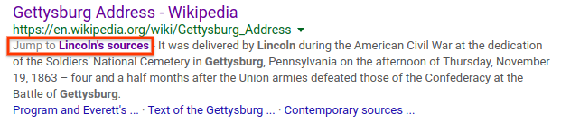
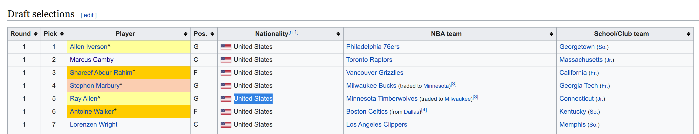
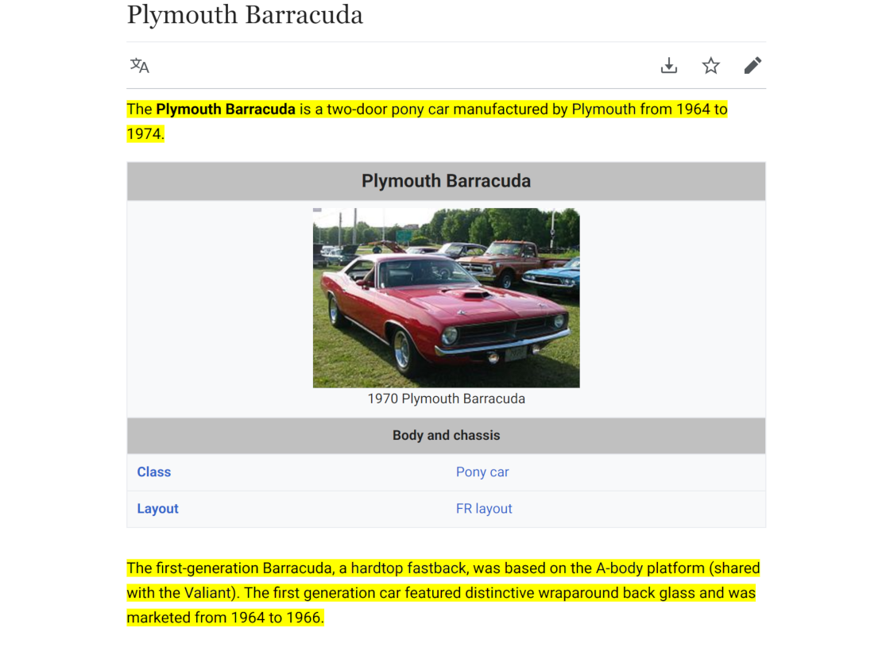
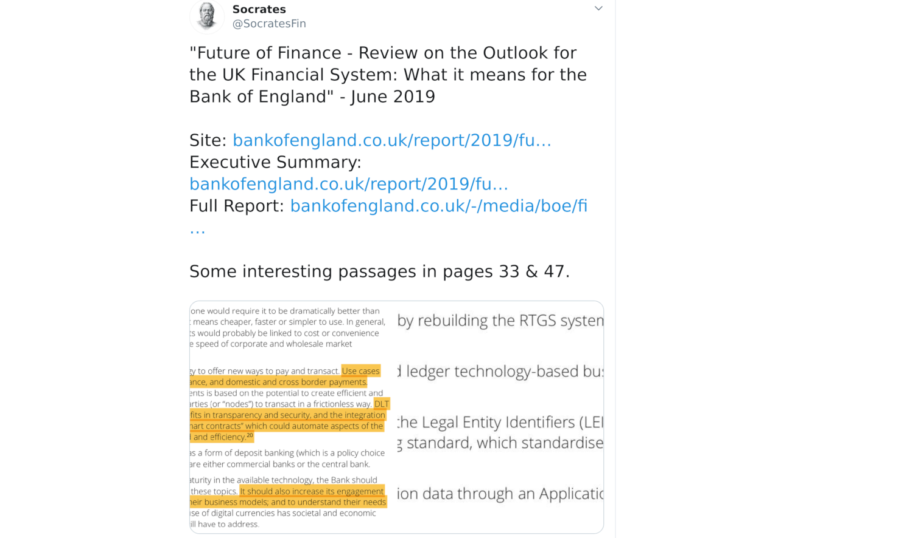

# Text Fragments

[Draft Spec](https://wicg.github.io/ScrollToTextFragment)  
[Web Platform Tests](https://wpt.fyi/results/scroll-to-text-fragment?label=experimental&label=master&aligned)  
[ChromeStatus entry](https://chromestatus.com/feature/4733392803332096)  

## Introduction

To enable users to easily link to specific content in a web page, we propose
adding support for specifying a text snippet in the URL. When navigating to
such a URL, the browser understands more precisely what the user is interested
in on the destination page. It may then provide an improved experience, for
example: visually emphasizing the text or automatically bringing it into view
or allowing the user to jump directly to it.


Web standards currently specify support for scrolling to anchor elements with
name attributes, as well as DOM elements with ids, when [navigating to a
fragment](https://html.spec.whatwg.org/multipage/browsing-the-web.html#scroll-to-fragid).
While named anchors and elements with ids enable scrolling to limited specific
parts of web pages, not all documents make use of these elements, and not all
parts of pages are addressable by named anchors or elements with ids.

### Current Status

This feature, as currently [specified in this repo](https://wicg.github.io/ScrollToTextFragment),
is shipping to stable channel in Chrome M80.

To opt out of text fragments, a [force-load-at-top Document Policy](#opting-out)
will be available once document policies have shipped. In the meantime, websites
can register for the [ForceLoadAtTop origin trial](https://developers.chrome.com/origintrials/#/view_trial/3253850730775183361),
which will ensure that no scrolling happens on page load, including via regular
fragment anchors and scroll restoration. For details on how to register a
website for an origin trial, see the [Origin Trials Guide for Web Developers](https://github.com/GoogleChrome/OriginTrials/blob/gh-pages/developer-guide.md).

### Motivating Use Cases

When following a link to read a specific part of a web page, finding the
relevant part of the document after navigating can be cumbersome. This is
especially true on mobile devices, where it can be difficult to find specific
content when scrolling through long pages or using the browser's "find in page"
feature. Fewer than 1% of clients use the "Find in Page" feature in Chrome on
Android.

To enable users to more quickly find the content they're interested in, we
propose generalizing the existing support for scrolling to elements based on
the fragment identifier. We believe this capability could be used by a variety
of websites (e.g. search engine results pages, Wikipedia reference links), as
well as by end users when sharing links from a browser.

#### Search Engines

Search engines, which link to pages that contain content relevant to user
queries, would benefit from being able to scroll users directly to the part of
the page most relevant to their query.

For example, Google Search currently links to named anchors and elements with
ids when they are available.  For the query "lincoln gettysburg address
sources", Google Search provides a link to the named anchor
[#Lincoln’s_sources](https://en.wikipedia.org/wiki/Gettysburg_Address#Lincoln's_sources)
for the [wikipedia page for Gettysburg Address](https://en.wikipedia.org/wiki/Gettysburg_Address)
as a "Jump to" link:



However, there are many pages with relevant passages with no named anchor or
id, and search engines cannot provide a "Jump to" link in such cases.

#### Citations / Reference links

Links are sometimes used as citations in web pages where the author wishes to
substantiate a claim by referencing another page (e.g. references in
Wikipedia). These reference pages can often be large, so finding the exact
passage that supports the claim can be very time consuming. By linking to the
passage that supports their underlying claim, authors can make it more
efficient for readers to follow their overall argument.

#### Sharing a specific passage in a web page

When referencing a specific section of a web page, for example as part of
sharing that content via email or on social media, it is desirable to be able
to link directly to the specific section. If a section is not linkable by a
named anchor or element with id, it is not currently possible to share a link
directly to a specific section.

Users may work around this by sharing screenshots of the relevant portion of
the document (preventing the recipient of the content from engaging with the
actual web page that hosts the content), or by including extra instructions to
scroll to a specific part of the document (e.g. "skip to the sixth paragraph").

We would like to enable users to link to the relevant section of a document
directly. Linking directly to the relevant section of a document preserves
attribution, and allows the user following the URL to engage directly with the
original publisher.

## Proposed Solution

### tl;dr

Allow specifying text as part of the URL fragment:

https://example.com#:~:text=prefix-,startText,endText,-suffix

Using this syntax

```
:~:text=[prefix-,]textStart[,textEnd][,-suffix]

         context  |-------match-----|  context
```
_(Square brackets indicate an optional parameter)_

Navigating to such a URL will cause the browser to indicate the first instance
of the matched text. The exact details of what a browser should do once it
finds a match are mosty beyond the scope of this proposal. Browsers are mostly
free to choose what kind of UI to surface, whether or not to scroll the text
into view on load, and how to visually emphasize it.

To restrict an attacker's ability to exfiltrate information across origins,
several restrictions are applied on when such an anchor is activated. A user
gesture is requred and consumed; text matching can only occur on word
boundaries. Additionally, the fragment will activate only if the document is
sufficiently isolated from other pages (is the only one in its browsing context
group, e.g.  no window.opener or iframes).

The text directive is delimited from the rest of the fragment using the `:~:`
token to indicate that it is a _fragment directive_ that the user agent should
process and then remove from the URL fragment that is exposed to the page. The
directive syntax solves the issue of compatibility with page that rely on the
URL fragment for routing/state, see
[issue #15](https://github.com/WICG/ScrollToTextFragment/issues/15).

### Background

We propose generalizing [existing
support](https://html.spec.whatwg.org/multipage/browsing-the-web.html#find-a-potential-indicated-element)
for scrolling to elements as part of a navigation by adding support for
specifying a text snippet in the URL. We modify the [indicated part of the
document](https://html.spec.whatwg.org/multipage/browsing-the-web.html#the-indicated-part-of-the-document)
processing model to allow using a text snippet as the indicated part. The
user agent may then follow the existing logic for [scrolling to the fragment identifier](https://html.spec.whatwg.org/multipage/browsing-the-web.html#scroll-to-the-fragment-identifier)
and/or apply other UI effects.

This extends the existing support for scrolling to anchor elements with name
attributes, as well as DOM elements with ids, to scrolling to other textual
content on a web page. Browsers first attempt to find an element that matches
the fragment using the existing support for elements with id attributes and
anchor elements with name attributes. If no matches are found, browsers then
will process the text snippet specification.

### Usability Goals

 * Users should be able to specify multiple, non-contiguous passages. There are
   two reasons this is important. The first is intrinsic; users sometimes want
   to emphasise multiple snippets of a larger text. [Examples](https://twitter.com/KingJames/status/1158904415618662400)
   [abound](https://twitter.com/surn_name/status/1205397168342716416) on
   [Twitter](https://twitter.com/anildash/status/574389867154661377).

   The second is to deal with complicated DOM cases where DOM order and text
   order doesn't align. A common example would be a column in a table, or a
   contiguous paragraph with an inline ad.

 * The user may wish to specify text that spans multiple paragraphs, list items,
   table entries, and other structures. Our proposal aims to allow users to
   target test crossing arbitrary DOM and visual boundaries.

 * The text the user wishes to target may not be unique on the page. The
   solution must account for this by providing ways to disambiguate multiple
   matches on a page.

  * Such links should be creatable for arbitrary pages across the web. This
    means they must be compatible with the vast majority of existing and future
    web sites.

### Identifying a Text Snippet

Here's an example URL encoding some text to indicate on the destination page:

https://en.wikipedia.org/wiki/Cat#:~:text=Claws-,Like%20almost,the%20Felidae%2C,-cats

```
:~:text=[prefix-,]textStart[,textEnd][,-suffix]

         context  |-------match-----|  context
```
_(Square brackets indicate an optional parameter)_

Though existing HTML support for id and name attributes specifies the target
element directly in the fragment, most other mime types make use of this x=y
pattern in the fragment, such as [Media
Fragments](https://www.w3.org/TR/media-frags/#media-fragment-syntax) (e.g.
#track=audio&t=10,20), [PDF](https://tools.ietf.org/html/rfc3778#section-3)
(e.g. #page=12) or [CSV](https://tools.ietf.org/html/rfc7111#section-2) (e.g.
#row=4).

The _text_ keyword will be used to identify a block of text that should be
indicated.  The provided text is percent-decoded before matching. Dash (-),
ampersand (&), and comma (,) characters in text snippets must be
percent-encoded to avoid being interpreted as part of the text fragment
syntax.

The [URL standard](https://url.spec.whatwg.org/) specifies that a fragment can
contain [URL code points](https://url.spec.whatwg.org/#url-code-points), as
well as [UTF-8 percent encoded
characters](https://url.spec.whatwg.org/#utf-8-percent-encode). Characters in
the [fragment percent encode
set](https://url.spec.whatwg.org/#fragment-percent-encode-set) must be percent
encoded.

There are two kinds of terms specified in the text directive: the _match_ and
the _context_. The match is the portion of text that’s to be indicated. The
context is used only to disambiguate the match and is not highlighted.

Context is optional, it need not be provided. However, the text directive must
always specify a match term.

#### Match
A match can be specified as either a single argument or as a pair.

If the match is provided using two arguments, the left argument is considered
the starting snippet and the right argument is considered the ending snippet
(e.g. `text=_startText_,_endText_`). In this case, the browser will perform
a "range search" for a block of text that starts with _startText_ and ends with
_endText_. If multiple blocks match the first in DOM order is chosen (i.e. find
the first occurence of startText, from there find the first occurence of
endText). When a match is specified with two arguments, we allow highlighting
text that spans multiple elements.

If the match is specified as a single argument, we consider it an "exact
search" (e.g. `text=_textSnippet_`). The browser will highlight the first
occurence of exactly the _textSnippet_ string. In this case, the specified text
will be matched only if it is contained within a single node.

Range matches are useful when the desired text match is extremely long.
For example, selecting multiple paragraphs of text using an exact match would
result in a very long and cumbersome URL.

<table><tr><td>
E.g. Given:
            
 * Text1
 * Text2
 * Text3
 * Text4

`text=Text2,Text4` will highlight all items except the first:

* Text1
* __Text2__
* __Text3__
* __Text4__

`text=Text2` will highlight just the second item:

* Text1
* __Text2__
* Text3
* Text4

</td></tr></table>

#### Context

To disambiguate non-unique snippets of text on a page, arguments can
specify optional _prefix_ and _suffix_ terms. If provided, the match term will
only match text that is immediately preceded by the _prefix_ text and/or
immediately followed by the _suffix_ text (allowing for an arbitrary amount of
whitespace in between). Immediately preceded, in these cases, means there are
no other text nodes between the match and the context term in DOM order. There
may be arbitrary whitespace and the context text may be the child of a
different element (i.e. searching for context crosses element boundaries).

If provided, the prefix must end (and suffix must begin) with a dash (-)
character. This is to disambiguate the prefix and suffix in the presence of
optional parameters. It also leaves open the possibility of extending the
syntax in the future to allow multiple context terms, allowing more complicated
context matching across elements.

If provided, the prefix must be the first argument to the text directive.
Similarly, the suffix must be the last argument.

<table><tr><td>

For example, suppose we want to perform the following highlight:



Since the text “United States” is ambiguous, we must provide a suffix to disambiguate it:

`text=United States,-Minnesota Timberwolves`

</td></tr></table>

### Multiple Text Directives

Users can specify multiple snippets by providing additional text directives in
the _fragment directive_, separated by the ampersand (&) character.

Each `text=` directive is considered independent in the sense that success or
failure to match in one does not affect matching of any others. Each starts
searching from the top of the document.

Only the left-most, successfully matched, directive will be the indicated part
of the document (i.e. used as the CSS target, scrolled into view). That is, if
“foo” did not appear anywhere on the page but “bar” does, we scroll “bar” into
view. However, all matched directives will be visually indicated on the page.

<table><tr><td>
For example:

```
example.com#:~:text=foo&text=bar&text=bas
```

will target each of “foo”, “bar”, and “baz” and use the “foo” result as the
indicated part of the document, assuming all appear on the page.

</td></tr></table>

Multiple terms can be useful when the desired text has unrelated inline
elements like images, ads, tables, etc:



Users may also wish to emphasize multiple passages of a larger text. We've
found many such examples online:



### Fragment Directive

Some existing pages on the web use fragments for their own state/routing. These
pages may break if an unexpected fragment is provided. See
[#15](https://github.com/WICG/ScrollToTextFragment/issues/15)

Element-id based fragments also cause these pages to break; however, text
fragments are much more likely to be user-generated and are thus more likely to
cause unexpected breakage. Pages that rely on fragment routing are also
unlikely to provide anchor points, whereas they are likely to have text.

Our solution to this is to introduce the concept of a _fragment directive_.
The fragment directive is a specially-delimited part of the URL fragment that
is meant for UA instructions only. It's stripped out from the URL during
document loading so that it's completely invisible to the page.

This allows specifying UA instructions like a text fragment in a way that's
guaranteed not to interfere with page script and ensures maximal compatibility
with the existing web.

However, stripping arbitrary parts of a fragment may not be web compatible! We
went through several ideas here:

#### The Double-Hash

We tried delimiting the fragment directive using `##`. It's ergonomic and works
well since, if the original URL doesn't have a fragment, the double-hash
delimiter will already be parsed as a fragment!

However, `#` is [not a valid code
point](https://url.spec.whatwg.org/#url-code-points) in the URL spec. As was
explained in a thread on the [w3.org URI mailing
list](https://lists.w3.org/Archives/Public/uri/2019Sep/0000.html), some URL
parsers parse from right to left. Having an additional `#` character will cause
these parsers to break. Worse, we don't have a good way to measure the risk.

Use counters we added to Chrome in M77 showed that, on Windows, about 0.08% of
page loads already have a `#` character in the fragment. While small, that's a
non trivial percentage.

#### Enter :~:

A new delimiter would have to be both spec-compliant with the URL spec and have
sufficiently low usage on the existing web such that this change would be
web-compatible.

We assumed this would preclude any single or double character sequences and
produced a list of candidates to consider:
* !~!
* !~~!
* \~&\~
* :~:
* \~@\~
* \~\_\~
* \_~\_

We also considered using a more verbose delimiter:
* &directive
* @directive
* $directive
* /directive
* -directive

Looking through links seen in the last 5 years by the Google Search crawler, we
eliminated some of this list. None of the "verbose" list had been seen;
however, given valid candidates in the first list, we prefered them for
succinctness and to reduce English-centric keywords.

Of the above list, the following had never been seen in a URL fragment by the
crawler:

* \~&\~ no hits
* :~: no hits
* \~@\~ one hit

While this doesn't guarantee compatibility, it did give us some confidence.  We
chose `:~:` from this list somewhat arbitrarily. However, we've also added
Chrome use-counters to M78 for all these delimiters. `:~:` is seen on fewer
than 0.0000039% of page loads (or about 1 in 25 million) so we currently
believe this is a safe choice.

#### Directives and Delimiters

When appending the `:~: token to a URL, it must appear inside a fragment so a
`#` must also be added:

`https://example.com` --> `https://example.com#:~:text=foo`

However, a URL with an existing fragment can simply be appended to:

`https://example.com#fallback:~:text=foo`

In this case, if the text match isn't found, the browser can fallback to
scrolling the element-id specified in the fragment (e.g. id="fallback" in this
case). Note that the text directive will always begin searching at the top of
the document, even if a matching element-id fragment is provided.

#### Compatibility and Interop

User agents that haven't implemented this feature won't know how to process the
fragment directive. Because it is part of the fragment, on most pages this will
simply be processed as a non-existent fragment so the page will load scrolled
to the top, as if a fragment weren't supplied. This is a graceful fallback.

A more risky scenario is apps that use the fragment for state and routing. In
these cases, the page is using the fragment in an application-defined maner and
adding any content to it impact how the page operates (this is one of the
motivating cases for using the fragment delimiter for `text=`).

In the worst case, such a URL on an unimplementing UA may navigate to a broken
page. However, most such pages we've seen handle this gracefully, e.g.:

https://groups.google.com/a/chromium.org/forum/#!topic/blink-dev/OOZIrtSPLeM:~:text=test

Is a Google Groups post with a directive appended. Loading it in an
unimplementing UA displays an "The input is invalid." toast in the corner but the
page otherwise loads as if without the directive. We expect many cases will
behave similarly but the potential of more serious breakage does exist.

Note: the fragment directive behavior (stripping everything after and including
the `:~:` delimiter from the fragment) can be implemented independently of the
larger proposal.

### :target

For element-id based fragments (e.g.
https://en.wikipedia.org/wiki/Cat#Anatomy), navigation causes the identified
element to receive the `:target` CSS pseudo-class. This is a nice feature as it
allows the page to add some customized highlighting or styling for an element
that’s been targeted. For example, note that navigating to a citation on a
Wikipedia page highlights the citation text:
https://en.wikipedia.org/wiki/Cat#cite_note-Linaeus1758-1

The `:target` CSS pseudo-class can only apply to elements whereas a text
snippet may only be a portion of the text in a node or span multiple nodes.

The `:target` pseudo-class is applied to the first common ancestor element that
contains all the matching text, for the left-most matching `text=` directive.

### Security Considerations

_Some of the more detailed reasoning behind the security decisions is described
in our [security review doc](https://docs.google.com/document/d/1YHcl1-vE_ZnZ0kL2almeikAj2gkwCq8_5xwIae7PVik/edit#heading=h.g7hd03ifqsc)_

If an attacker can detect a side-effect of a successful match, this feature
could be used to detect the presence of arbitrary text on the page. For
example, if the UA scrolls to the targeted text on navigation, an attacker
might be able to determine whether a scroll occurred by listening to network
requests or using an IntersectionObserver from an attacker-controlled iframe
embedded on the target page.

A related attack is possible if the existence of a match takes significantly
more or less work than non-existence. An attacker can navigate to a text
_fragment directive_ and time how busy the JS thread is; a high load may imply
the existence or non-existence of an arbitrary text snippet. This is a
variation of a documented
[proof-of-concept](https://blog.sheddow.xyz/css-timing-attack/).

UAs are free to determine how a successfully matched text fragment should be
surfaced to the user based on their own assessment of how much risk certain
actions present. For example, whether scrolling on navigation is likely to be
detectable in enough cases.

To prevent brute force attacks from guessing important words on a page (e.g.
passwords, pin codes), matches and prefix/suffix are only matched on word
boundaries. E.g.  “range” will match in “mountain range” but not in “color
orange” nor “forest ranger”.

Word boundaries are simple in languages with spaces but can become more subtle
in languages without breaks (e.g. Chinese). A library like ICU [provides
support](http://userguide.icu-project.org/boundaryanalysis#TOC-Word-Boundary)
for finding word boundaries across all supported languages based on the Unicode
Text Segmentation standard. Some browsers already allow word-boundary
matching for the window.find API which allows specifying wholeWord as an
argument. We hope this existing usage can be leveraged in the same way.

Additionally, a text directive is invoked only if a user gesture occurred and
the loaded document is the only one in its browsing context group. The latter
restriction is effectively requiring `rel=noopener` be specified on a
navigation.

Visual emphasis is performed using a visual-only indicator (i.e. don’t cause
selection), styled by the UA and undetectable from script. This helps prevents
drag-and-drop or copy-paste attacks.

### Opting Out

To allow websites to opt out of text fragments, we propose adding a [Document
Policy](https://github.com/w3c/webappsec-feature-policy/blob/master/document-policy-explainer.md)
named force-load-at-top that ensures the page is loaded without any form of
scrolling, including via text fragments, regular element fragments, and scroll
restoration. Websites can use this document policy by serving the HTTP header:

```
Document-Policy: force-load-at-top
```

## Alternatives Considered

### Text Fragment Directive 0.1

A prior revision of this document contained a somewhat similar proposal. The
main difference in the updated proposal is that it adds context terms to the
text directive. This helps to allow disambiguating text on a page as well as
brings this proposal more in-line with the Open Annotation's
[TextQuoteSelector](https://www.w3.org/TR/annotation-model/#text-quote-selector).
Many use cases and details were considered while iterating on the initial
revision. The updated proposal is a sum of lessons learned and improved
understanding as we experimented with and considered the initial version and
its limitations

### CSS Selector Fragments

Our initial idea, explored in some detail, was to allow encoding a CSS selector
in the URL fragment. The selector would determine which element on the page
should be the "indicated element" in the [navigating to a
fragment](https://html.spec.whatwg.org/multipage/browsing-the-web.html#scroll-to-fragid)
steps. In fact, this explainer is based on @bryanmcquade's original [CSS
Selector Fragment
explainer](https://github.com/bryanmcquade/scroll-to-css-selector).

The main drawback with this approach was making it secure. Allowing scroll on
load to a CSS selector allows several ways an attacker could exfiltrate hidden
information (e.g. CSRF tokens) from the page. One such attack is demonstrated
[here](https://blog.sheddow.xyz/css-timing-attack/) but others were quickly
discovered as well.

Trying to pare down the allowable set of primitives to make selectors secure
turned out to be quite complex. Text snippets, which can be searched
asynchronously and are generally less security sensitive, became our preferred
solution. As an additional bonus, we expect text snippets to be more stable and
easier to understand by non-technical users.

### Increase use of elements with named anchors / id attributes in existing web pages

As an alternative, we could ask web developers to include additional named
anchor tags in their pages, and reference those new anchors. There are two
issues that make this less appealing. First, legacy content on the web won’t
get updated, but users consuming that legacy content could still benefit from
this feature. Second, it is difficult for web developers to reason about all of
the possible points other sites might want to scroll to in their pages. Thus,
to be most useful, we prefer a solution that supports scrolling to any point in
a web page.

### JavaScript-based API (instead of URL fragment)

We also considered specifying the target element via a JavaScript-based
navigation API, such as via a new parameter to location.assign(). It was
concluded that such an API is less useful, as it can only be used in contexts
where JavaScript is available. Sharing a link to a specific part of a document
is one use case that would not be possible if the target element was specified
via a JavaScript API. Using a JavaScript API is also less consistent than
existing cases where a scroll target is specified in a URL, such as the
existing support in HTML, as well as support for other document formats such as
PDF and CSV.

## Future Work

One important use case that's not covered by this proposal is being able to
scroll to an image. A nearby text snippet can be used to scroll to the image
but it depends on the page and is indirect. We'd eventually like to support
this use case more directly.

A potential option is to consider this just one of many available [Open
Annotation selectors](https://www.w3.org/TR/annotation-model/#selectors).
Future specification and implementation work could allow using selectors other
than TextQuote to allow targetting various kinds of content.

Another avenue of exploration is allowing users to specify highlighting in more
detail. There are also cases where the user may wish to prevent highlights
altogether, as in the image search case described above.

We've thought about these cases insofar as making sure our proposed solution
doesn't preclude these enhancements in the future. However, the work of
actually realizing them will be left for future iterations of this effort.

## Additional Considerations

### Constructing Arguments to Text Fragments

We imagine URLs with text fragment directives to primarily be
machine-generated rather than crafted by hand by users. At the same time, we
believe there's a benefit to keeping the URL relatively
human-readable: in most cases, simply copying and pasting the desired passage
should generate a text fragment directive that will scroll and highlight the
desired passage.

The two systems that we believe will generate the bulk of such URLs are
browsers and search engines. We forsee users selecting text from the browser,
with an option to "share a link to here". These links can then be shared
further as wikipedia reference links or over channels like social media or
email.

Search engines can also generate text directive URLs as links to search results
for user queries; these links may scroll to and highlight relevant passages to
the user's query. Note that even though using the selected text as the
textStart argument to the text directive may work reasonably well in practice
as a heuristic, generating URLs targetting arbitrary text requires access to
the full document text up to the desired text. Both browsers and search
engines have access to the entire visible text of the page, so it is indeed
possible for these systems to generate proper URLs with text directive
arguments that scroll and highlight any arbitrary text.

### Web and Browser Compatibility

As noted in [issue #15](https://github.com/WICG/ScrollToTextFragment/issues/15),
web pages could potentially be using the fragment to store parameters, e.g.
`http://example.com/#name=test`. If sites don't handle unexpected tokens when
processing the fragment, this feature could break those sites. In particular,
some frameworks use the fragment for routing. This is solved by the user agent
hiding the :~:text part of the fragment from the site, but browsers that
do not have this feature implemented would still break such sites.

For pages that don't process the fragment, a browser that doesn't yet support
this feature will attempt to process the fragment and _fragment directive_
(i.e. :~:text) using the existing logic to find a [potential indicated
element](https://html.spec.whatwg.org/multipage/browsing-the-web.html#find-a-potential-indicated-element).
If a fragment exists in the URL alongside the _fragment directive_, the browser
may not scroll to the desired fragment due to the confusion with parsing the
_fragment directive_.  If a fragment does not exist alongside the _fragment
directive_, the browser will just load the page and won't initiate any
scrolling.  In either case, the browser will just fall back to the default
behavior of not scrolling the document.

### Relation to existing support for navigating to a fragment

Browsers currently support scrolling to elements with ids, as well as anchor
elements with name attributes. This proposal is intended to extend this
existing support, to allow navigating to additional parts of a document. As
Shaun Inman [notes](https://shauninman.com/archive/2011/07/25/cssfrag) (in
support of CSS selector fragments), this feature is "not meant to replace more
concise, author-designed urls" using id attributes, but rather "enables a
site’s users to address specific sub-content that the site’s author may not
have anticipated as being interesting".

## Related Work / Additional Resources

### Using CSS Selectors as Fragment Identifiers

Simon St. Laurent and Eric Meyer
[proposed](http://simonstl.com/articles/cssFragID.html) using CSS Selectors as
fragment identifiers (last updated in 2012). Their proposal differs only in
syntax used: St. Laurent and Meyer proposed specifying the CSS selector using a
```#css(...)``` syntax, for example ```#css(.myclass)```. This syntax is based
on the XML Pointer Language (XPointer) Framework, an "extensible system for XML
addressing" ... "intended to be used as a basis for fragment identifiers".
XPointer does not appear to be supported by commonly used browsers, so we have
elected to not depend on it in this proposal.

[Shaun Inman](https://shauninman.com/archive/2011/07/25/cssfrag) and others
later implemented browser extensions using this #css() syntax for Firefox,
Safari, Chrome, and Opera, which shows that it is possible to implement this
feature across a variety of browsers.

The [Open Annotation Community
Group](https://www.w3.org/community/openannotation/) aims to allow annotating
arbitrary content. There is significant overlap in our goal of specifying a
snippet of text in a resource. In fact, they've already specified a
[TextQuoteSelector](https://www.w3.org/TR/annotation-model/#text-quote-selector)
for similar purposes.

This proposal has been made similar to the TextQuoteSelector in hopes that we
can extend and reuse that processing model rather than inventing a new one,
albeit with a stripped down syntax for ease of use in a URL. Our work has been
informed specifically by prior efforts at selecting arbitrary textual content
for an annotation.

Scroll Anchoring

* [https://drafts.csswg.org/css-scroll-anchoring/](https://github.com/WICG/ScrollAnchoring/blob/master/explainer.md)
* [https://docs.google.com/document/d/1YaxJ0cxFADA_xqUhGgHkVFgwzf6KXHaxB9hPksim7nc/edit](https://docs.google.com/document/d/1YaxJ0cxFADA_xqUhGgHkVFgwzf6KXHaxB9hPksim7nc/edit)

Scroll to text

* [https://indieweb.org/fragmention](https://indieweb.org/fragmention)
* [http://zesty.ca/crit/draft-yee-url-textsearch-00.txt](http://zesty.ca/crit/draft-yee-url-textsearch-00.txt)
* [http://1997.webhistory.org/www.lists/www-talk.1995q1/0284.html](http://1997.webhistory.org/www.lists/www-talk.1995q1/0284.html)

Other

* [https://en.wikipedia.org/wiki/Fragment_identifier#Examples](https://en.wikipedia.org/wiki/Fragment_identifier#Examples)
* [https://www.w3.org/TR/2017/REC-annotation-model-20170223/](https://www.w3.org/TR/2017/REC-annotation-model-20170223/)
