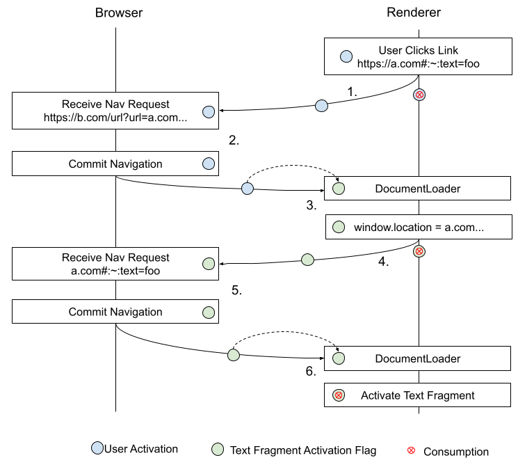

# Enabling Text Fragments in Client-Side Redirects

## Background

Links with text fragments do not properly work with client-side redirects.  For
example, clicking this link:

[https://t.co/9JkH5EOXO1?amp=1](https://t.co/9JkH5EOXO1?amp=1)

results in a client-side redirect to
https://www.babynames.com/#:~:text=%23blacklivesmatter, which is loaded by the
browser, but #blacklivesmatter is not highlighted as is desired.  However,
clicking on the link itself results in the intended behavior.

In Chrome, links with text fragments
[require a user activation](https://github.com/WICG/scroll-to-text-fragment#user-content-security-considerations:~:text=Additionally%2C%20a%20text%20directive%20is%20invoked,one%20in%20its%20browsing%20context%20group.)
to scroll to the fragment.  Server-side redirects (using 3xx status codes)
propagate the original user activation bit, and thus work as intended.  However,
client-side redirects (200 response with javascript that modifies
window.location) cannot tie the original user activation to the window.location
navigation.

We expect sharing to be a major use case for text fragment links;
today, users (e.g. on Twitter) share screenshots of highlighted text,
often without the attributing link ([example](https://twitter.com/dellcam/status/1273255557743497221)).

We see two, non-mutually-exclusive, solutions: move the ecosystem away from
client-side redirects towards server-side redirects and/or implement a
text-fragment specific solution.

## Moving the ecosystem towards server side redirects

Several sites and apps (most prominently Twitter and their t.co links,
Hangouts, Facebook) use client-side redirects instead of server side redirects.
We've done some background research and found some specific reasons for this
preference:

* Attribution: Server-side redirects attribute clicks to the source website,
  which makes social platforms look smaller.  In particular, when a user
  clicks a t.co url on example.com, Twitter would like the referrer to show
  t.co. This seems like a major blocker and would require additions to HTTP
  referrer-policy or a new header.
* Interop and Bugs: A lack of interoperable behavior in how various edge-cases
  are treated means that client-side redirects (which had more interoperable
  behavior) were easier to use. Example bugs:
  * Safari loses fragments in an HTTP redirect - [WebKit 24175](https://bugs.webkit.org/show_bug.cgi?id=24175) (fixed!)
  * Safari loses fragment in multiple HTTP redirects - [WebKit 158420](https://bugs.webkit.org/show_bug.cgi?id=158420)
  * Safari rewrites Search URLs (to be friendly) but loses fragments - the URL rewriter is avoided using a client-side redirect: [WebKit 194925](https://bugs.webkit.org/show_bug.cgi?id=194925).

  It seems the situation here has improved significantly over the years, though
  there's still some way to go and it will take time for the fixes to be
  deployed at sufficient scale.
* Privacy and security: Client-side redirects have been used to strip PII
  (referrer headers). They can also be used to present an interstitial before
  navigating. We believe these use cases predate support for referrer-policy
  and could now be satisfied using 3xx redirects (however, with non-trivial
  effort)

In theory, these obstacles can be overcome through a combination of evangelism
and modifications to HTTP referrer policy.  In practice, historical bugs and
inconsistencies make this a long-term battle.

It should be noted that server side redirects are generally accepted across the
industry as the better practice. Making this shift would also help in allowing
transmission of other headers like Sec-Fetch-User. For these reasons, moving
the ecosystem towards server-side redirects should be the long-term goal.
However, we'll need a fix for the more immediate future as moving the ecosystem
will be, at minimum, a years-long effort.

## Text-Fragment-specific Solution

Note: This was previously called the "Text Fragment Token" but renamed, see
#178.

Introduce a "text fragment activation flag". This flag grants permission to
invoke a text fragment. The flag can be used during a document load to invoke
the text fragment, or it can be passed into a navigation to grant permission to
the next page without requiring a user activation. However, in either case, the
flag is consumed so a page cannot both invoke a text fragment and pass the flag.

The flag is set in only one place, during document load, and it is only set if
the load is the result of a user initiated navigation. Thus, this mechanism can
be thought of as a user activation that applies only to text fragments, whose
lifetime extends across navigations but can be used only once (is always
consumed on use). Effectively, it allows a page to successfully navigate to a
text-fragment without a user gesture once; however, further attempts require a
user gesture since the flag is consumed and only generated by a user gesture.

### Example

1. User clicks a link to https://e.co/abcde; a link through a popular
  redirection service. This creates a user activation in the window which is
  consumed and stored by the navigation request.
2. The e.co redirector sends a 200 response with script in the body. Because
  the navigation request has a user activation bit, the document load consumes
  it to create a new text fragment activation flag. Note: user activations on
  navigations are used only to identify the navigation as having been initiated
  by a user activation - it does not confer a user activation on the destination
  browsing context.
3. The script now navigates the frame to the real destination:
  https://a.com#:~:text=foo. It consumes its text fragment activation flag and sets it on
  the navigation request. At this point, even if the page were to continue
  loading, it would not be allowed to activate a text fragment since the flag
  has been consumed.
4. The response from a.com is received. Its request does not have a user
  activation associated with it, but it does have a text fragment activation
  flag. The request's flag is consumed and transfered to the newly loading
  document.
5. Because the document has a text fragment activation flag, it is consumed to
  activate the text fragment in the URL and scroll it into view.

## FAQ

#### Why is it ok to allow a user activation for a text-fragment to cross a navigation boundary?

Suppose an attacker convinces a user to click a link to `evil.com`. `evil.com`
can (at an arbitrary time) navigate with `window.location =
"secure.com#:~:text=..."` and the text fragment will activate (assuming other,
non-user-activation, conditions are met). i.e. If the user navigated to an
attacker's page with a user activation, the attacker's page can cause 1
text-fragment navigation to a destination of their choice.

Why is this ok?

* evil.com has to navigate itself away, it would need an additional user
  activation to open a popup. Text fragments wont activate if there's multiple
  entries in the browsing context group so it shouldn't be able to see what
  happens on the destination page anyway.
* If the attacker can convince to user to click a link to evil.com, they could
  have sent them straight to the destination page as well. It's possible they
  might use their own page to setup some state, but text fragment activation
  still requires [an isolated browsing context
  group](https://wicg.github.io/scroll-to-text-fragment/#ref-for-session-history:~:text=If%20document%E2%80%99s%20browsing%20context%20is%20a,set%20has%20length%201%20return%20true).
* The main benefit a user activation provides is that if an attacker does find
  some side channel that lets them see the text fragment effect on the
  destination, they cannot repeat the attack arbitrarily. This still holds.

In short, the user activation is mainly meant to prevent a repeatable attack since
extracting a single activation from a user isn't a high bar. The other
[mitigations described in the spec](https://wicg.github.io/scroll-to-text-fragment/#security-and-privacy)
remain sufficient.

#### Why not just propagate user activations?

This seems much scarier since lots of other things rely on user activations and
don't share the above properties so this would have much wider implications.
Also, because of the other uses, consuming the user activation from text fragments
isn’t straightforward. Here, we can consume the text fragment when forwarded or
activated; this ensures that 1 user activation allows only 1 text fragment
activation.

#### Will this work through multiple redirects?

Yes - the flag is only consumed when a URL with a text fragment is loaded so
intermediate pages will propagate it. For example, a link in Hangouts Chat
actually does two redirects.

#### Does this mean a flag could be propagated indefinitely?

Yes - but this should be ok because its only purpose is to activate a text
fragment and it cannot be cloned; we still maintain 1 user activation == 1
activation. We could add some limit or consume on pages without a text fragment
after some timeout but this seems like it would add complexity, introduce
brittleness, and have limited benefit.
